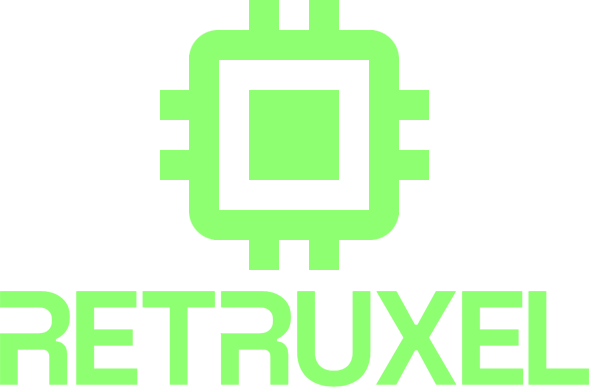
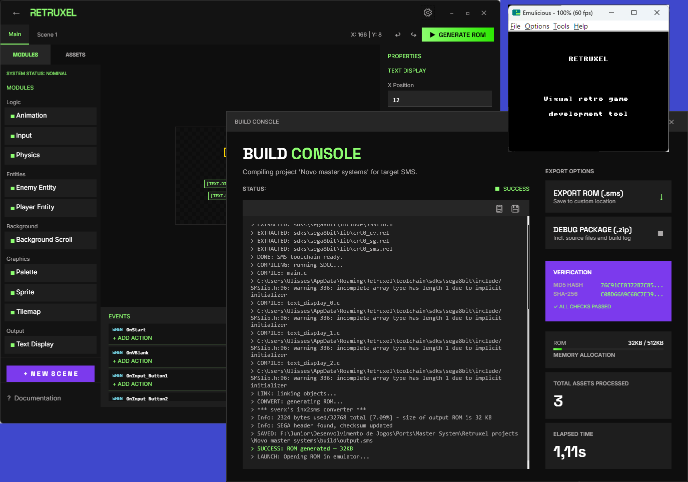

# Retruxel

<p align="center">
  
</p>

> Visual retro game development tool — build games for classic consoles without writing a single line of code.
> 
> Inspired by [GB Studio](https://www.gbstudio.dev/)

---

<!-- Application screenshot -->


---

## What is Retruxel?

Retruxel is a visual IDE for developing retro games, inspired by [GB Studio](https://www.gbstudio.dev/). Instead of writing C or assembly by hand, you use a visual editor to place modules, configure parameters through an auto-generated UI, and Retruxel handles the rest — generating C code, compiling it with the embedded toolchain, and producing a ready-to-run ROM file.

No terminal. No Makefile. No toolchain setup. Just open and start building.

---

## ✨ Features

- 🎮 **Visual game editor** — place modules on canvas and configure them through auto-generated UI
- 🎯 **Multi-target support** — build for multiple retro consoles from a single project
- ⚙️ **Zero setup** — toolchains embedded and extracted automatically on first run
- 🧩 **Module system** — graphic, logic and audio modules as building blocks
- 🔁 **Portable modules** — universal modules keep your project target-agnostic for future migration
- 🏗️ **Auto-generated UI** — module parameters are described via `ModuleManifest`, no UI code needed
- 📦 **One-click ROM export** — full build pipeline from project to ROM file
- ⭐ **Favorites system** — mark and filter your preferred target platforms
- 🌍 **Multilingual** — interface available in multiple languages with runtime switching
- 🚀 **Emulator integration** — launch ROMs directly from the IDE

---

## 🎯 Supported Targets

| Console | Status | Toolchain |
|---|---|---|
| Sega Master System | 🟢 Active | SDCC 4.5.24 + devkitSMS + SMSlib |
| Nintendo NES | 🟢 Active | cc65 + neslib |
| Sega Game Gear | 🟡 Scaffolding | SDCC 4.5.24 + devkitSMS + SMSlib |
| Sega SG-1000 | 🟡 Scaffolding | SDCC 4.5.24 + devkitSMS + SMSlib |
| ColecoVision | 🟡 Scaffolding | SDCC 4.5.24 + devkitSMS + SMSlib |
| SNES | 🔮 Planned | — |

---

## 🏛️ Architecture

Retruxel is built on .NET / WPF and organized as a multi-project solution:

| Project | Type | Role |
|---|---|---|
| `Retruxel` | WPF Application | Main shell — UI and navigation |
| `Retruxel.Core` | Class Library | Interfaces, models and core services |
| `Retruxel.SDK` | Class Library | Public interfaces for plugin developers |
| `Retruxel.Toolchain` | Class Library | Embedded toolchains (SDCC + devkitSMS for Sega/Coleco, cc65 for NES) |
| `Retruxel.Target.SMS` | Class Library | SMS-specific modules and target implementation |
| `Retruxel.Target.NES` | Class Library | NES-specific modules and target implementation |
| `Retruxel.Target.GameGear` | Class Library | Game Gear target implementation (scaffolding) |
| `Retruxel.Target.SG1000` | Class Library | SG-1000 target implementation (scaffolding) |
| `Retruxel.Target.ColecoVision` | Class Library | ColecoVision target implementation (scaffolding) |

### Build Pipeline

**SMS / Game Gear / SG-1000 / ColecoVision:**
```
.rtrxproject  →  CodeGenerator  →  .c / .h files  →  SDCC  →  ihx2sms  →  .sms ROM
```

**NES:**
```
.rtrxproject  →  CodeGenerator  →  .c / .h files  →  cc65  →  ld65  →  .nes ROM
```

### Module System

Modules are the building blocks of every Retruxel project. There are three types:

- **Graphic modules** — tiles, sprites, palettes, tilemaps
- **Logic modules** — physics, input, entities, game flow
- **Audio modules** — music and sound effects for the target sound chip

Each module exposes a `ModuleManifest` that describes its parameters. The shell reads this manifest and auto-generates the configuration UI — no WPF knowledge required to write a module.

Modules are distributed as DLLs. Official modules live in `/modules/`, user plugins in `/plugins/`.

#### Portability categories

| Category | Description |
|---|---|
| **Universal** | Identical JSON output on any target — fully portable |
| **Base + Specialization** | Shared base with optional target-specific fields |
| **Exclusive** | Target-locked — marked with a warning icon in the UI |

---

## 🎨 Design System

Retruxel uses a custom design system called **Neo-Technical Archive** — a modern IDE aesthetic inspired by 1980s mainframe terminals.

- **Style:** Architectural Brutalism + Modern Editorial Design
- **0px border-radius** on all internal components
- **8px grid** — no exceptions
- Separation by tonal background shift — no divider lines
- Typography: **Space Grotesk** (display) + **Inter** (body/code)

---

## 🚀 Getting Started

> ⚠️ Retruxel is currently in early alpha development (v0.4.0-alpha). Builds are not yet available for download.

1. Clone the repository
2. Open `Retruxel.slnx` in Visual Studio 2022+
3. Build and run the `Retruxel` project
4. The toolchain is extracted automatically on first run to `%AppData%\Retruxel\toolchain\`

### Current Status

- ✅ Project creation and management
- ✅ Multi-target infrastructure with 5 platforms
- ✅ Visual scene editor with canvas
- ✅ Text display module (SMS + NES)
- ✅ Event system (OnStart, OnVBlank, OnInput)
- ✅ Code generation and ROM compilation (SMS + NES)
- ✅ Build console with real-time output and toast notifications
- ✅ Emulator integration with configurable launch settings
- ✅ Favorites system with sort and filter capabilities
- ✅ Internationalization (i18n) system with runtime language switching
- ✅ Dynamic manufacturer discovery and filtering
- 🚧 Additional modules (in progress)
- 🚧 Plugin system (planned)
- 🚧 Asset editors (planned)

---

## 🌍 Internationalization

Retruxel supports multiple languages with automatic detection and runtime switching.

### Supported Languages

- 🇺🇸 English
- 🇧🇷 Português (Brasil)

### Adding a New Language

1. Create a new JSON file in `Retruxel/Assets/Localization/` with the language code as filename (e.g., `es.json` for Spanish)
2. Use this structure:

```json
{
  "_metadata": {
    "code": "es"
  },
  "strings": {
    "app.title": "RETRUXEL",
    "welcome.title": "SELECCIÓN DE TARGET",
    ...
  }
}
```

3. The language will appear automatically in Settings → General → Language
4. Language names are automatically localized using .NET `CultureInfo` based on your OS language

### How It Works

- Language files are discovered automatically on startup
- Display names are pulled from the operating system (e.g., "Español" on Spanish Windows, "Spanish" on English Windows)
- No restart required — switch languages instantly in Settings
- Fallback to English if selected language file is missing

---

## 🧩 Writing a Plugin

> 🚧 Plugin system is planned but not yet implemented.

Retruxel plugins will be standard .NET class libraries that reference `Retruxel.SDK`. Implement one of the module interfaces (`IGraphicModule`, `ILogicModule`, `IAudioModule`), drop the compiled DLL into the `/plugins/` folder, and Retruxel will discover and load it automatically.

```csharp
public class MyModule : ILogicModule
{
    public string ModuleId => "myplugin.mymodule";
    public string DisplayName => "My Module";
    // ...
}
```

---

## 📄 License

This project is licensed under the MIT License. See [LICENSE](LICENSE) for details.
