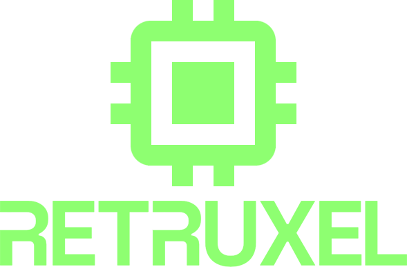

# Retruxel

<p align="center">
  
</p>

<p align="center">
  
  
  
  
  
  
</p>

> **Retruxel** – a visual IDE for retro‑game development. Build games for classic consoles without writing a single line of C or assembly.

---

## 📖 Overview

Retruxel is a visual IDE for developing retro games, inspired by [GB Studio](https://www.gbstudio.dev/). Retruxel lets you design games with a drag‑and‑drop canvas, configure modules through auto‑generated UI, and handles all code generation, compilation and ROM packaging automatically. The toolchain for each target is bundled with the application, so no external SDKs are required.

---

## 🏛️ Architecture

The solution is a multi‑project .NET 10 / WPF solution with a **plugin‑based** architecture. The main projects are:

| Project | Type | Role |
|---|---|---|
| `Retruxel` | WPF Application | UI shell, navigation and orchestration |
| `Retruxel.Core` | Class Library | Core services, models, code‑generation engine |
| `Retruxel.SDK` | Class Library | Public API for third‑party plugin developers |
| `Retruxel.Toolchain` | Class Library | Embedded toolchains (SDCC, cc65, etc.) and adapters |
| `Retruxel.Modules` | Class Library | Portable module definitions (graphics, logic, audio) |
| `Plugins/Tools/*` | Class Libraries | Stand‑alone tools (image processing, palette helpers, etc.) |
| `Plugins/CodeGens/*` | JSON + Templates | Declarative code generators (`.c.rtrx` + `codegen.json`) |
| `Plugins/Targets/*` | Class Libraries | Platform‑specific implementations (SMS, NES, GG, SG‑1000, Coleco) |

### Build Pipeline (high‑level)

```
.rtrxproject → ModuleRenderer (JSON + .c.rtrx templates) → .c/.h files
    → Target toolchain (SDCC / cc65) → Linker → ROM
    ↓
  Tool invocations (pre‑processors, asset converters)
```

The pipeline is the same for all supported targets; only the final toolchain differs.

---

## 🧩 Core Components

- **Module System** – Graphic, Logic and Audio modules. Each module exposes a `ModuleManifest` that drives the auto‑generated UI.
- **Code Generation** – Declarative JSON manifests + Handlebars‑style templates (`.c.rtrx`).
- **Plugin Framework** – Plugins are discovered via reflection at startup. Developers can add new code generators, tools or target platforms without modifying the core.
- **Embedded Toolchains** – SDCC for SMS/Game Gear/SG‑1000/Coleco, cc65 for NES, with automatic extraction to `%AppData%\Retruxel\toolchain` on first run.
- **Emulator Integration** – Launches ROMs directly in the built‑in emulator window.
- **Internationalisation** – UI strings are stored in JSON files under `Retruxel/Assets/Localization` and can be switched at runtime.

---

## 🚀 Getting Started

### Option 1 – Installer (recommended)
1. Download the latest installer from the **[Releases page](https://github.com/ulissesemuman/Retruxel/releases)**.
2. Run the installer; the toolchain is extracted automatically to `%AppData%\Retruxel\toolchain`.
3. Launch **Retruxel** from the Start menu.

### Option 2 – Build from source
1. Clone the repository:
   ```bash
   git clone https://github.com/ulissesemuman/Retruxel.git
   cd Retruxel
   ```
2. Open `Retruxel.slnx` in **Visual Studio 2022** (or later) and build the solution.
3. Run the `Retruxel` project. The first launch extracts the embedded toolchains.

---

## 🛠️ Development Workflow

1. **Create a new project** – The wizard scaffolds a `.rtrxproject` file.
2. **Add modules** – Drag modules onto the scene canvas, configure parameters in the property panel.
3. **Generate code** – The IDE automatically runs the `ModuleRenderer` and creates C source files under the project’s `Generated` folder.
4. **Build** – Press **Build**; the appropriate toolchain compiles the sources and produces a ROM.
5. **Test** – The built‑in emulator can launch the ROM instantly for quick iteration.

---

## 📦 Plugins & Extensions

- **Code Generators** – Place a folder under `Plugins/CodeGens/<module>/<target>/` containing `codegen.json` and a `.c.rtrx` template.
- **Tools** – Implement `ITool` in a class library under `Plugins/Tools/` and reference it from a code generator.
- **Targets** – Implement `ITarget` under `Plugins/Targets/` to add support for new consoles.

All plugins are loaded automatically at startup via reflection.

---

## 🌍 Internationalisation

Add a new language by creating a JSON file in `Retruxel/Assets/Localization/` (e.g., `es.json`). The file follows the structure:
```json
{
  "_metadata": { "code": "es" },
  "strings": { "app.title": "RETRUXEL", "welcome.title": "SELECCIÓN DE TARGET" }
}
```
The UI will list the language automatically.

---

## 🤝 Contributing

Contributions are welcome! Please fork the repository, create a feature branch and open a pull request. Follow the existing code style and run the full build before submitting.

---

## 📄 License

This project is licensed under the **MIT License**. See the [LICENSE](LICENSE) file for details.
